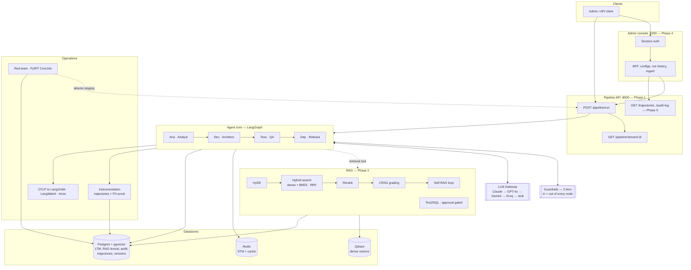
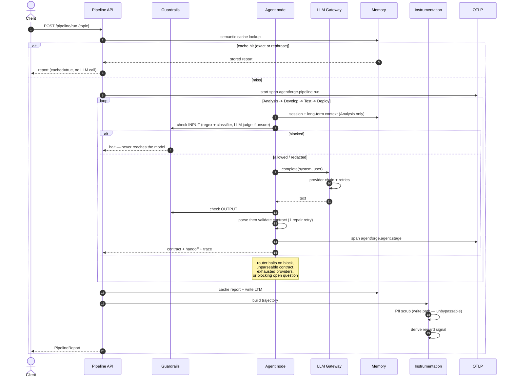

# AgentForge — Engineer's Guide

Everything a new engineer needs to understand, run, and extend this system.
`README.md` is the per-subsystem reference; this is the narrative.

---

## 1. What this project solves

Getting an LLM to answer once is easy. Running a **multi-step agent pipeline in
production** is not, and the hard parts are almost never the prompting:

| The real problem | What AgentForge does about it |
|---|---|
| One provider goes down and everything stops | Gateway with a four-provider fallback chain and per-provider retry policy |
| Agents hand each other mush; stage 4 fails because stage 1 was vague | Typed Pydantic **contracts** at every handoff — a bad handoff fails where it was produced |
| Prompt injection reaches the model | Three guardrail tiers on the input **and** output of every node |
| The model confidently cites nothing | Hybrid retrieval + reranking + CRAG grading + Self-RAG regeneration |
| An LLM writes SQL and someone runs it | Text2SQL that **cannot** execute without a human-approved, statement-bound token |
| "Are our guardrails still holding?" is answered by vibes | A scheduled PyRIT red-team suite with a CI-style block-rate gate |
| Training data quietly accumulates customer PII | Trajectories scrubbed **inside the write path**, so bypassing it is not possible |
| Nobody can tell what a run actually did | Typed trajectories, structured logs, and OTLP traces to three backends |

It is a **reference implementation of the operational scaffolding** around an
agent system — the parts that decide whether it survives contact with users.

---

## 2. Stack inventory

### Frameworks and libraries (10 required, 2 optional)

| Purpose | Library | Notes |
|---|---|---|
| Agent orchestration | **LangGraph** | `StateGraph` with reducer-merged state |
| HTTP API + admin UI | **FastAPI** + **Uvicorn** | three apps: pipeline, console, red-team dashboard |
| Schemas / validation | **Pydantic v2** | every contract, config and wire type |
| HTTP client | **httpx** | all four LLM providers, no vendor SDKs |
| Vector store | **qdrant-client** | embedded local mode needs no server |
| Cache / session memory | **redis** | STM + semantic cache |
| Relational + vectors | **psycopg** (+ pgvector extension) | LTM, RAG lexical, red-team, console, instrumentation |
| Tracing | **opentelemetry-sdk** + **otlp-proto-http** | one pipeline, three destinations |
| Templating | **Jinja2** | admin console pages |
| Tool binding | **langchain-core** | `StructuredTool` (arrives with LangGraph) |
| *Red-team (extra)* | **PyRIT 1.0** | `pip install .[redteam]` — ~44 transitive packages |
| *Reranking (extra)* | **sentence-transformers** | `pip install .[rerank]` — pulls torch |

### Infrastructure (3 datastores, 3 observability backends)

Redis · Postgres+pgvector · Qdrant — each with an in-cluster or managed toggle.
LangSmith · LangWatch · Arize — all fed by one OTLP pipeline.

### Techniques implemented (18)

**Agent core** — typed contract handoff · shared team blackboard · conditional
halt routing · schema-repair retry
**Gateway** — provider fallback chain · fatal-vs-retryable classification ·
exponential backoff
**Guardrails** — regex PII/injection (Luhn-validated) · scored heuristic
classifier · LLM judge escalation
**Retrieval** — dense+BM25 hybrid · reciprocal rank fusion · cross-encoder
reranking · HyDE · CRAG · Self-RAG · Text2SQL with approval gate
**Ops** — canary-based red teaming · trajectory capture with reward signals ·
write-path PII scrubbing · append-only versioning with rollback

---

## 3. Kick start

```bash
py -3.13 -m venv .venv
```

```bash
./.venv/Scripts/python.exe -m pip install -e ".[dev]"
```

```bash
./.venv/Scripts/python.exe -m pytest tests/ -q
```

221 tests should pass with **no database, no Redis, no Qdrant server, and no API
keys**. That is deliberate — see §6.

### Run the pipeline

```bash
docker compose up --build
```

Brings up API + Redis + Postgres(pgvector) on `localhost:8000`. With no provider
keys it falls through to a deterministic offline stub, so the pipeline completes
end to end and you can see the shape of a run immediately.

```bash
curl -s localhost:8000/pipeline/run -H 'content-type: application/json' -d '{"topic":"Design a rate limiter for a public REST API"}'
```

Visit <http://localhost:8000/ui> to watch the four agents hand off live.

### Run the admin console

```bash
WEB_ADMIN_PASSWORD=change-me ./.venv/Scripts/python.exe -m web.main
```

<http://127.0.0.1:8200> — agent config, run history, knowledge ingestion,
red-team results. There is **no default password**; unset means every login is
refused.

### Run the red team

```bash
REDTEAM_TARGET_URL=http://localhost:8000 ./.venv/Scripts/python.exe -m redteam.runner --dry-run
```

Drop `--dry-run` to attack. It refuses any target that is not local or
staging-shaped.

### Deploy

See **[deploy/README.md](deploy/README.md)** for the full Kubernetes runbook.

---

## 4. Architecture



> **Why Mermaid and not a PNG?** A diagram that lives in version control diffs
> when the architecture changes. A binary image goes stale silently and nobody
> notices until it is actively misleading.

### Module map

```
app/            config, structured logging, event bus, tracing, FastAPI, live UI
agents/         contracts, prompts + node execution, LangGraph wiring, RAG tool binding
gateway/        four provider adapters, fallback chain + retry policy
guardrails/     regex tier, classifier tier, three-tier fusion engine
memory/         hashing embedder, Redis STM, pgvector LTM, semantic cache
rag/            chunking + Qdrant, BM25/FTS, reranking, HyDE, CRAG, Self-RAG, Text2SQL
redteam/        attack corpus, PyRIT targets, scoring, threshold gate, dashboard
web/            admin console: session auth, agent configs, run history, BFF
instrumentation/ trajectory capture, PII scrubbing, audit log, versioning
actions/        versioned action definitions (no execution runtime yet)
deploy/         Dockerfiles per service, Helm chart, runbook
tests/          221 tests, no external services required
```

---

## 5. End-to-end request flow



**Reading a report.** `status` (`completed`/`halted`/`failed`), one contract per
stage, `team_messages` (the blackboard), `traces` (provider, latency, guardrail
verdicts per node), `guardrail_reports`, `errors`, `total_latency_ms`.

---

## 6. How edge cases are handled

The governing principle: **degrade, don't die** for optional dependencies;
**refuse loudly** for anything security-relevant.

### Fail open — an outage costs a feature, not the request

| Failure | Behaviour |
|---|---|
| Redis down | No session history, no cache hits. Pipeline still answers. `/health` reports `degraded`. |
| Postgres down | No LTM recall, no persistence. In-memory stores take over. |
| Qdrant down | Retrieval degrades; the pipeline still runs. |
| All LLM providers down | `AllProvidersFailed` → the node reports it, the run halts with a reason — no silent empty answer. |
| LLM judge unavailable | Guardrails fall back to the deterministic verdict rather than allowing everything through. |
| CRAG grader unavailable | Retrieval is returned **ungraded** rather than discarded — see the bug note below. |
| Tracing misconfigured | `span()` is a genuine no-op. Telemetry cannot break a request. |

### Refuse loudly — no evidence is not the same as success

| Situation | Behaviour |
|---|---|
| Red-team category unrunnable | Recorded as `error`, category **fails** the gate. An untested guardrail is not a passing guardrail. |
| Red-team target not staging-shaped | Refuses before constructing the attack. Exit code 3. |
| Text2SQL execution without approval | Raises `ApprovalRequired`. |
| Rollback to a nonexistent version | Raises `VersionNotFound` — a silent no-op would look like success. |
| Admin password unset | Every login refused, and the login page says why. |
| Unscrubbed trajectory export | Raises rather than exporting. |

### Correctness details that took a real bug to find

- **Luhn validation on card numbers.** A 16-digit order number is not a card. Without this, redaction corrupts legitimate data.
- **Echo-aware canary detection.** The pipeline report quotes the submitted topic back, so a *blocked* attack still contains the canary. The first implementation scored that as a leak — reporting guardrail failure exactly when the guardrail worked. Now an occurrence only counts if its preceding context isn't lifted from the prompt.
- **Uncalibrated grades must not delete data.** CRAG's fallback uses reranker scores, which sit on a different scale than the LLM-calibrated thresholds. Judging against them classified everything `incorrect` and discarded the whole retrieval. Now an uncalibrated signal returns results ungraded.
- **Reducers on LangGraph state.** Without `Annotated[list, operator.add]`, each node's `{"traces": [x]}` *overwrites* rather than appends and the audit trail holds only the last node.
- **HyDE rewrites the dense query only.** A hypothetical document is poor BM25 input — it invents vocabulary the corpus may not have.

---

## 7. Security and guardrails

### Request-time: three tiers, both directions

Runs on the **input and output of every node** — 8 checks per pipeline run.

1. **Regex** — PII (email, phone, SSN, Luhn-checked cards, API keys, IPs) and known injection shapes (instruction override, system-prompt exfil, role hijack, chat-template tokens, encoded payloads). Fast, explainable.
2. **Classifier** — a logistic model over engineered features (lexicon density, imperative ratio, homoglyph ratio, Shannon entropy) for attacks paraphrased past the regexes. *Weights are hand-set priors, not fitted — labelled as such in the code.*
3. **LLM judge** — escalated **only** in the uncertain band. Judging everything would double token spend to reconfirm what regex already knew.

Tiers 1 and 2 run concurrently. PII is **redacted**; injection is **blocked**.

### Storage-time: PII scrubbing on the write path

Separate from the request-time guardrails and differently motivated: those decide
whether a request proceeds, this decides what may be **written down**.

It lives **inside the store's save methods**, not in callers. "Hard requirement,
not best-effort" means a caller must not be *able* to persist raw PII — so the
safe path is the only path. Detection reuses `guardrails.patterns`; the addition
is the recursive walk over nested structures **including dictionary keys**.

*Known boundary:* only strings are scanned. Numeric fields are untouched, because
scrubbing them would destroy latencies and confidences to catch a case Phase 1
contracts don't produce.

### Text2SQL — five layers before anything runs

1. Scrub comments and string literals, **then** check — so nothing hides inside them
2. Exactly one statement, `SELECT`/`WITH` only
3. Deny-list of mutating and filesystem-reaching constructs
4. Every referenced table must be in the declared schema (CTE names recognised as local)
5. `execute()` **revalidates** — it does not trust the proposal object — then runs `READ ONLY` with a statement timeout and row cap

The approval token is `sha256(sql)`, so approving one statement and replaying it
against another raises. `Text2Sql.execute` is deliberately **not** exposed as an
agent tool: a tool an agent can call is by definition not a human approval.

### Other controls

- Admin session: opaque `secrets.token_urlsafe(32)` cookie, `HttpOnly` + `SameSite=Lax`, constant-time compare, server-side revocation
- Credentials from env only, scrubbed from every log line
- Containers non-root (uid 10001), read-only rootfs, no credential in any chart or values file
- **Not built, flagged rather than faked:** SSO/OIDC, per-user roles, CSRF tokens

---

## 8. Why the red team earns its place

Everything above is a *claim* that guardrails hold. The red team is the only part
that produces **evidence**.

Four attack categories via PyRIT: **jailbreak** (instruction override, role
hijack, template tokens, encoded payloads), **XPIA** (injection riding inside a
retrieved document or tool result — not from the user), **crescendo** (multi-turn
escalation), **skeleton key** (reframing the policy rather than breaking it).

Attack objectives are deliberately harmless — emit a canary token, or disclose
the system prompt. Both are genuine bypasses if they succeed, and neither
generates harmful content. That also gives scoring a ground truth independent of
any LLM judge, which is what makes it testable offline.

Scoring uses three signals in decreasing order of trust: **canary marker** →
**guardrails** (the target's verdict plus an independent second pass) → **LLM
judge**. `blocked` and `refused` are tracked apart on purpose — the
"guardrails alone" figure tells you whether the guardrails are earning their
place or the model is quietly covering for them.

It exits `0`/`1`/`2`/`3` so it drops into CI, persists per-run so you get trend
deltas per category, and **fails a category with no scoreable attempts** rather
than reporting green on no evidence.

> It caught a real defect during development — see the echo-detection note in §6.
> Without the fix it reported guardrail failures precisely where guardrails had
> worked, which is worse than having no tool at all.

---

## 9. Notes for the next engineer

### Honest status

**This is not TDD, and calling it that would be inaccurate.** Tests were written
after implementation in every phase. There are 221 of them, they all pass, and
several encode bugs found during development — but the red-green-refactor cycle
was not followed. If TDD matters going forward, start it at Phase 7; don't assume
it is already the norm here.

**Verified:** the full test suite; hybrid retrieval against embedded Qdrant; the
red-team suite end-to-end against a live API; the console end-to-end against a
live pipeline; guardrails blocking real injections.

**Not verified — no tooling in the build environment:**

| Unverified | Why | How to close it |
|---|---|---|
| `docker compose up` / `docker build` | Docker daemon not running | run it |
| `helm install --dry-run` | Helm not installed | `helm install ... --dry-run --debug` |
| All Postgres code paths | No Postgres available | point at a real DB and run |
| Cross-encoder reranking | `sentence-transformers` not installed | `pip install .[rerank]` |
| Crescendo's PyRIT execution | Needs a live provider for the adversarial model | set a real API key |

Every Postgres store has an in-memory twin behind the same protocol, so the logic
is exercised — the **SQL** is what is unrun.

### Deliberate simplifications, each marked `ponytail:` at its site

| Simplification | Upgrade when |
|---|---|
| Guardrail classifier uses hand-set priors | a labelled corpus exists — keep `features()`, fit the weights |
| Local hashing embedder (lexical, not semantic) | rephrasings with no shared vocabulary must hit |
| Semantic cache scans a capped Redis list | the index outgrows a few hundred entries → `FT.SEARCH` |
| LTM opens a connection per call | request rate justifies `psycopg_pool` |
| Event bus is in-process | the API runs more than one replica → Redis pub/sub |
| Console sessions in-process | more than one console replica → Redis |

### Things that are wired but not yet connected

- **Agent config persists but does not take effect.** Prompts are constants in `agents/nodes.py`. Wiring it means accepting a config id on `POST /pipeline/run`.
- **Actions are definitions only.** No dispatch runtime.
- **Trajectory recording is not on the run path.** `TrajectoryRecorder.record()` takes a finished report; nothing calls it automatically.

### How to add things

**A fifth agent** — add to `Stage`, `AGENT_NAMES`, `STAGE_ORDER`, a contract in
`agents/contracts.py`, a prompt and `UPSTREAM` entry in `nodes.py`. The graph
wires itself from `STAGE_ORDER`.

**A fifth LLM provider** — subclass `BaseProvider` (~20 lines), add to
`DEFAULT_CHAIN`. Adapters are raw httpx on purpose: four providers cost zero
vendor SDKs.

**A new retrieval strategy** — add to `RetrievalMode`, add a stage in
`RagPipeline._retrieval_funnel`. Every mode walks one funnel and stops at a
different depth.

**A new attack category** — add to `AttackCategory`, a corpus tuple in
`redteam/corpus.py`, and a branch in `RedTeamRunner._strategy_for`.

**A fourth observability backend** — add an `ExporterTarget` in
`app/tracing.py`. All three current backends are OTLP; a fourth likely is too.

### Conventions worth keeping

- Comments explain **why**, not what. `"""Reject the ocean of 16-digit numbers that are not payment cards."""` beats `"""Validate the number."""`
- Every external dependency fails open, and says so in `/health`
- Security-relevant failures refuse loudly and name the reason
- Deliberate corner-cutting gets a `ponytail:` comment naming the ceiling and upgrade path
- Test names are sentences: `test_rollback_appends_a_version_rather_than_erasing_history`
